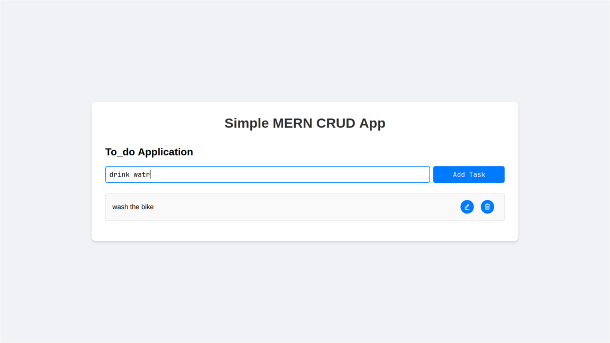
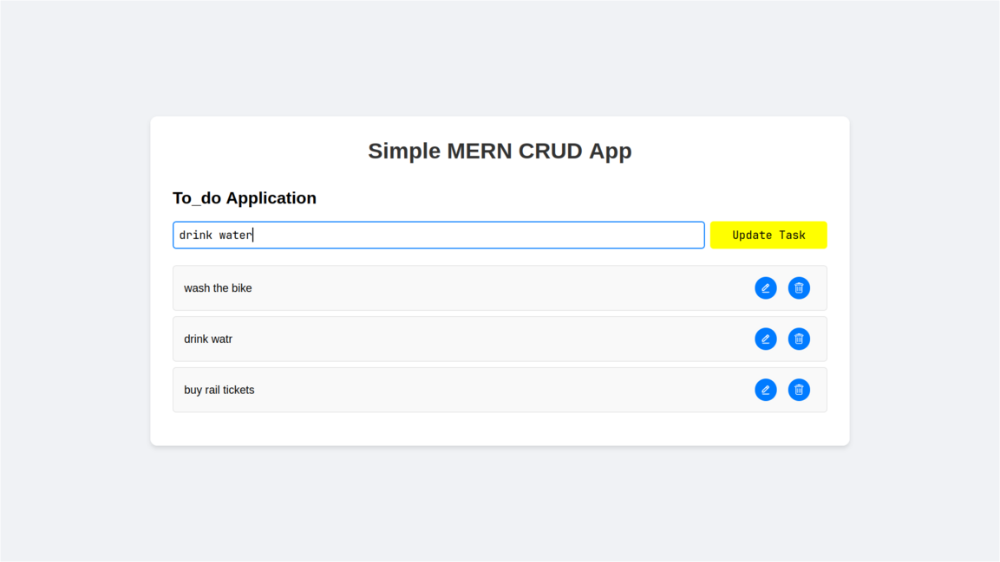
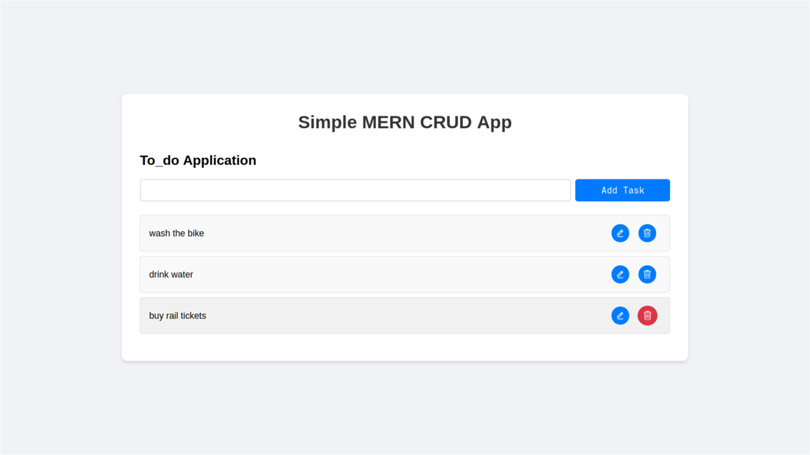

## Minimal TO DO application with MERN Stack

## Details
### Forntend
Uses axios, react-icons, reactjs, vite
### Backend
Uses MangoDB(mongooes), expressJS, dotenv


## Installation and run
```sh
clone the repo
```
### Run Client or Frontend
```sh
cd client
npm run dev
```
### Run Server or backend
```sh
cd server
npm run dev
```

### Note 
MangoDB culster connect required and access should be provided either for your IP address or any IP address

The should be in .env file inside server folder
```sh
MONGO_URL = your link to mangoDB culster
PORT = 3000
```

## Screenshots:



